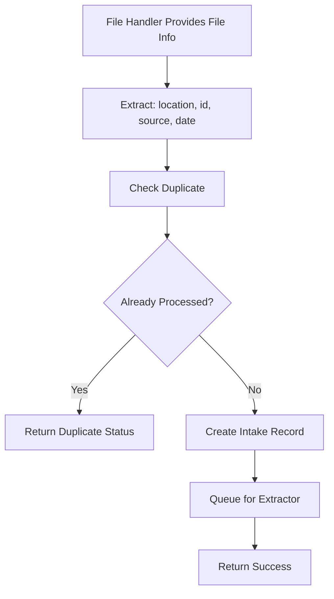
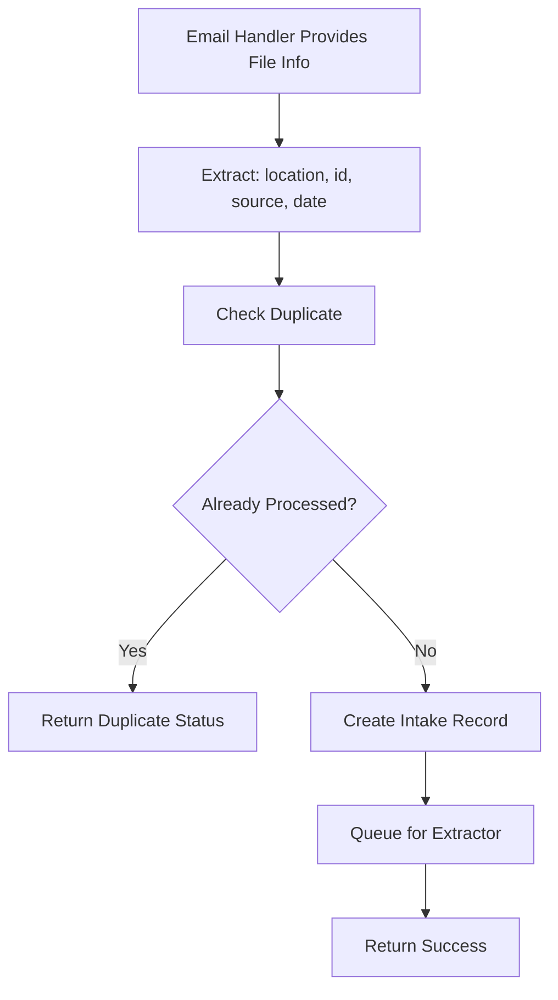

# File Intake Handler - Detailed Specifications

## Overview

The File Intake Handler is responsible for coordinating the intake of documents from multiple sources (file uploads and email attachments). It serves as the central coordination point that accepts requests, performs duplicate detection, delegates to appropriate handlers, and manages intake tracking.

## Core Responsibilities

1. **Duplicate Detection**: Check MongoDB for previously processed documents using file location, id, source, and date
2. **Queue Management**: Queue new documents for the extractor when no duplicates are found
3. **Status Tracking**: Create and update intake records for tracking purposes
4. **Error Coordination**: Handle duplicate checking and queueing errors

## Architecture Components

### Core Classes

#### FileIntakeManager

**Purpose**: Central orchestrator for all intake operations

**Responsibilities**:

- Receive file information from file and email handlers
- Check for duplicate documents using file location, id, source, and date
- Queue new documents for the extractor
- Track processing status of intake operations

**Key Workflows**:

1. **File Handler Request**: Receive file info → check duplicates → queue for extractor if new
2. **Email Handler Request**: Receive file info → check duplicates → queue for extractor if new

#### DuplicateChecker

**Purpose**: Prevent processing of duplicate documents

**Duplicate Detection Strategy**:

```python
def check_duplicate(self, file_location: str, file_id: str, source: str, date: datetime) -> DuplicateResult:
    """
    Check if this combination has been processed before:
    - file_location: Path or identifier of the file
    - file_id: Unique identifier for the file
    - source: Source system/method (email, upload, etc.)
    - date: Date of the file/processing
    """

    # Check for exact match of location, id, source, and date combination
    existing_record = self.db.find_intake_by_combination(
        file_location=file_location,
        file_id=file_id,
        source=source,
        date=date
    )

    if existing_record:
        return DuplicateResult(
            is_duplicate=True,
            existing_id=existing_record.intake_id,
            message=f"Already processed: {existing_record.processing_status}"
        )

    return DuplicateResult(is_duplicate=False)
```

#### IntakeRecord

**Purpose**: Data structure for tracking intake operations

**Record Management**:

```python
def create_intake_record(self, file_info: FileInfo) -> IntakeRecord:
    """
    Create intake record for tracking purposes
    """

    intake_record = {
        "file_location": file_info.file_location,
        "file_id": file_info.file_id,
        "source": file_info.source,
        "date": file_info.date,
        "processing_status": "queued_for_extraction",
        "created_at": datetime.now(),
        "updated_at": datetime.now()
    }

    return self.db.save_intake_record(intake_record)
```

## Processing Workflows

### File Handler Request Workflow



### Email Handler Request Workflow



## Integration with Other Components

The File Intake Handler receives requests from and coordinates with:

- **File Handler**: Provides file information (location, id, source, date) for duplicate checking
- **Email Handler**: Provides email attachment information (location, id, source, date) for duplicate checking
- **Extractor**: Receives queued files for content extraction and processing
- **Database**: Stores intake records and performs duplicate lookups

## Data Flow and Storage

### Intake Record Management

```python
def update_intake_status(self, record_id: str, status: str, details: dict = None):
    """
    Update intake record processing status
    """

    update_data = {
        "processing_status": status,
        "updated_at": datetime.now()
    }

    if details:
        update_data["status_details"] = details

    return self.db.update_intake_record(record_id, update_data)

def get_intake_record(self, record_id: str) -> IntakeRecord:
    """
    Retrieve intake record by ID
    """
    return self.db.get_intake_record(record_id)
```

## Error Handling

### Error Categories for Intake Operations

1. **Duplicate Detection Errors**: Database connection issues during duplicate checking
2. **Queue Management Errors**: Unable to queue documents for extractor
3. **Database Errors**: Cannot create or update intake records
4. **File Info Validation Errors**: Invalid or missing file information from handlers

### Error Recovery Strategies

```python
class IntakeErrorHandler:
    def handle_duplicate_check_error(self, error: DatabaseError, file_info: FileInfo):
        """Continue intake process, log error for later duplicate check"""
        self._log_duplicate_check_failure(error, file_info)
        self._queue_for_extraction_with_warning(file_info)
        self._schedule_delayed_duplicate_check(file_info)

    def handle_queue_error(self, error: QueueError, file_info: FileInfo):
        """Retry queueing or use alternative queue mechanism"""
        self._retry_queue_operation(file_info, error)

    def handle_file_info_validation_error(self, error: ValidationError, file_info: FileInfo):
        """Reject request and notify sender of missing/invalid information"""
        self._log_validation_error(error, file_info)
        self._notify_sender_of_validation_error(file_info, error.details)
```
